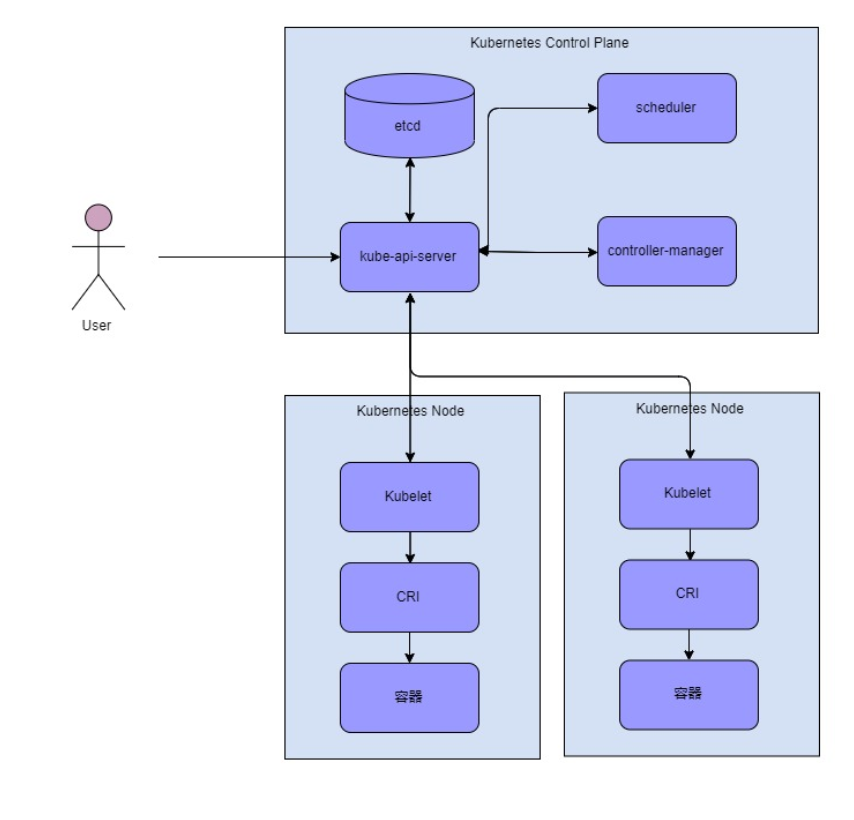

| Number | Category      | Status | Author | Organization | Created    |
| ------ | ------------- | ------ | ------ | ------------ | ---------- |
| 0001   | Informational | Draft  | 宁志伟 | 溪塔科技     | 2020-06-23 |

# CITA-Cloud产品定位白皮书

## 概述

区块链技术可以打破传统商业模式中的信任边界，有效地降低跨企业协作中的摩擦成本，因此其在企业场景中的应用受到越来越多的关注。

早期的区块链项目都是公链，面向无许可的场景。一般采用`PoW`共识算法，具有`TPS`低，能耗/成本高的特点，同时治理机制复杂，功能升级要得到矿工/开发者社区的一致同意，协调难度大，时间长。因此不适用于企业应用。联盟链在其基础上，进行了一系列的技术改造，使其更加适用于企业应用。一方面将共识算法从`PoW`换为基于`Quorum`的共识，比如`PBFT`，减少了能耗，降低了成本，同时也能实现更高的`TPS`。另一个方面，参与方数量少，相对固定并且实名化之后，治理相对公链也简单了很多。

基于联盟链的企业应用大致有两类解决方案。一类在产品定位上沿袭公链的思路，作为去中心化应用平台，让企业用户以智能合约/`Dapp`的方式开发应用。部署方式上为私有化部署，由企业用户负责运维。另外一类是传统的企业应用大厂，从企业应用的思路出发，加入区块链的元素。比如`IBM`和微软提出的区块链即服务平台(`BaaS`)，基于云平台，为企业提供开箱即用的区块链平台和端到端的解决方案。部署方式为云端集中化部署，企业用户几乎感知不到区块链的存在。

然而这两类解决方案都各自有比较严重的缺陷。对于第一类方案，联盟链的成本降低之后，企业出于隐私/安全等方面的考虑，更倾向于为每个应用设置专用的链，因此应用平台的产品定位就不成立了。而且企业用户一般已经有比较完善的`IT`系统，让其使用智能合约的方式开发企业应用，切换成本太高。而第二类方案，为了企业用户使用上的便利，放弃了区块链最独特的去中心化特性。这样会引发的不仅仅是隐私和数据安全的小问题，一旦终端用户开始怀疑企业对其持有的数据的掌控力，就会对整个业务逻辑产生毁灭性的打击。目前还没有一种解决方案可以完美的适应企业场景。

在本文中我们提出了一种新的产品设计思路，可以针对企业场景制定基于联盟链的解决方案，避免前面提到的各种问题。我们梳理了已有的应用案例，发现联盟链在实际的企业应用中，一般只是存储业务数据的元信息。这跟`etcd`在`Kubernetes`系统中的作用非常类似，而`Kubernetes`已经在企业应用中得到广泛的应用。我们分析了`Kubernetes`的架构，发现很多联盟链的企业应用解决方案可以借鉴的地方，且有很多组件可以直接复用。同时我们也发现`Kubernetes`在一些新兴的去中心化场景中，也可以从联盟链中借鉴很多东西。我们的思路是将联盟链和`Kubernetes`进行深度融合，保留区块链去中心化特性的同时，也达到让企业用户使用便利的目的。

## 现有联盟链解决方案

现有联盟链解决方案基本上都是延续以太坊的思路。其软件栈包括：支持智能合约的底层链，各种语言的`SDK`，用户钱包，区块链浏览器等。

应用采用`Dapp`的形式，可以认为是一种`B/S`架构。客户端通常是一个网页，或者直接嵌入到用户钱包中。服务器被区块链代替，应用的服务端以智能合约的形式运行在区块链上，这又有点类似云原生中的`Serverless`方案。底层链的定位是`Dapp`平台，多个`Dapp`复用同一条链。

*Figure 1. Dapp Architecture*

联盟链的创新更多的是在底层链上。替换共识算法；增加一些企业级的运维，治理，权限等功能；根据应用场景需求，增加隐私等扩展功能。

## `BaaS`

`BaaS`是`Blockchain as a Service`——区块链即服务。其主要思路是，将区块链作为一种平台，将其封装成一个`PaaS`系统。

*Figure 2. Blockchain as a Service*

`BaaS`屏蔽了底层联盟链的运维工作，使得创建一个链更加的简单，同时将底层链的管理功能以服务的形式暴露出来，更加方便开发者进行二次开发。其依然延续了联盟链平台化的定位，对于平台上的应用开发者而言，跟现有联盟链解决方案没有太大区别。

因为云原生技术的发展，`IaaS`层一般会使用`Kubernetes`，可以算是联盟链和云原生技术一种比较轻度的结合。

## 企业应用案例分析

目前我们实施过的应用案例，大致可以归为两类：

1. 存证。企业将各种档案，公证信息等存证到联盟链系统中。联盟链可以保证这些数据不会被非法篡改，合法的修改也会有操作记录，让这些数据在多个参与方之间更可信。但是受限于存储空间和操作响应时间，一般是把原始数据哈希之后，只把哈希值存储到链上。原始数据依然存放在传统存储设备中，比如文件服务器，云盘等。原始数据的传输也是通过传统的方式进行，接收方收到原始数据之后对其做一次哈希，对比存储在链上的哈希值，以确认原始数据没有被篡改。
2. 工作流。相当于传统`ERP`系统的跨企业版本。通过把传统`ERP`系统中的数据库替换为联盟链，利用区块链打破信任边界的特性，使得`ERP`系统的应用范围扩展到企业间。业务相关的功能还是由企业已有的`IT`系统负责，本工作流系统只负责在链上维护业务的进展和状态以及相关的事件信息。

从上述案例可以看到，用户还是会尽量复用已有的`IT`系统，或者依然采用传统的`IT`解决方案来处理复杂的企业应用。只会把少量，且必须要得到其他参与方信任的数据，比如哈希值，进度和事件信息放到链上。因此联盟链在其中的角色更像是一个分布式的元信息存储系统。

现有解决方案在这些场景的问题：

* 切换成本太高。如前所述，按照现有联盟链解决方案的理想情况，是希望用户完全以智能合约的方式实现业务的。这个对于一些新兴的场景，比如`DeFi`，因为没有历史包袱，这个解决方案是可行的。但是对于相对传统的企业来说，已经拥有比较完善的`IT`系统的情况下，切换成本太高。这也是为什么实际应用案例中通常不会用到复杂的智能合约，甚至都用不到智能合约。
* 平台化定位不成立。除非是像`BSN`这样的机构，本身没有业务，机构定位就是做平台。对于企业用户来说，系统通常还有非常复杂的区块链之外的业务系统，联盟链在整个系统中的占比比较低。出于隐私/安全等方面的考虑，企业通常会选择私有化部署。
* 生态不够成熟。现有的解决方案更偏向与`B/S`的架构，但是在企业场景中更类似`C/S`的架构。类似用网页游戏的引擎来制作魔兽世界，确实太困难了。在中间件以及配套的工具上面，整个生态都不够完善和成熟。

## 云原生简介

云原生以微服务，容器，容器编排为主要技术，目的是构建一个完善的基础设施，可以方便的在云这种新型的动态环境中构建和部署应用。

2015 年由`Google`、`Redhat`以及微软等大型云计算厂商以及一些开源公司共同牵头成立了 `CNCF`—— 云原生基金会。谷歌和`Redhat`发布的`Kubernetes` 成为了`CNCF`托管的第一个开源项目。

`CNCF`成立五年来，吸引了大量企业参与，在自动化运维/容器技术/配置管理/网络/存储/安全等方面都涌现了大量优秀的项目。详情参见[CNCF landscape](https://landscape.cncf.io/images/landscape.png)。

`Kubernetes`是一个生产级别的容器编排系统，用于自动部署，扩展和管理容器化应用程序。

*Figure 3. Kubernetes Architecture*

`Kubernetes`主节点由以下几个核心组件组成：

- `etcd`保存了整个集群的状态。
- `apiserver`提供了资源操作的唯一入口，并提供认证、授权、访问控制、`API`注册和发现等机制。
- `controller manager`负责维护集群的状态，比如故障检测、自动扩展、滚动更新等。
- `scheduler`负责资源的调度，按照预定的调度策略将`Pod`调度到相应的机器上。

我们可以把`Kubernetes`本身视作一个业务系统，其业务就是集群资源调度。那么它也是一个`C/S`架构，`etcd`加上`apiserver`是服务端，`scheduler`和`controller`是客户端。这部分也只是维护集群状态的元数据，真正落实业务，进行实际调度操作的是`Kubelet`，`CRI`等更边缘的组件。

## 联盟链与`Kubernetes`的比较

联盟链与`Kubernetes`很多方面都非常类似，但是又存在一些细节上的差异。

#### 分布式技术

`Kubernetes`中的关键组件`etcd`使用了`Raft`一致性算法，跟联盟链常用的`PBFT`共识算法作用是类似的。

只不过`Kubernetes`针对的还是中心化场景，使用分布式技术的目的仅仅是为了保持系统的高可用性，因此选择的算法是非拜占庭容错的。而联盟链针对的是去中心化场景，其安全假设是不同的，可能存在恶意节点，因此选择的是拜占庭容错算法。

两种技术比较明显的区别是信任的边界不同。

`etcd`的节点都在一个机房内，节点间是相互信任的，其安全边界是在整个系统外面。只要通过防火墙等安全措施把入口控制，整个系统的安全问题就解决了。

*Figure 4. Centralized*

联盟链的节点分散在不同的机构，节点间是相互不信任的，其安全边界在节点间。无法像中心化系统一样，通过控制入口来解决安全问题，必须使用签名等密码学方案来保证数据的安全，这其实也符合近年来提出的`零信任安全`。

*Figure 5. Decentralized*

#### 可扩展性

联盟链一般都拥有图灵完备的虚拟机，用户可以通过智能合约扩展联盟链的功能。

接口方面，联盟链一般采用`RPC`的方式，只提供少量通用的接口，比如发送交易，调用合约。调用时的参数按照事先约定的格式以二进制发的方式传递，因此少量接口就可以适用于不同的合约。当然客户端就需要针对不同的合约做一些额外的处理，但是一般`SDK`里都提供了相应的辅助功能，比如根据合约的`ABI`自动生成调用的代码。

`Kubernetes`也是高度可扩展的。其中一种方式是`Operator`模式。一个`Operator`是由用户自定义资源（`CRD`）和对应的`Controller`软件组成的。其中`CRD`相当于联盟链中智能合约的存储部分，因为`etcd`只有存储的功能，没有执行代码的功能。对应的`Controller`软件则相当于智能合约代码部分的链外形式，再加上一些客户端的处理。

接口方面，`Kubernetes`的`apiserver`提供的是`Restful`风格的`API`。每个资源，都对应一个`API`对象，对应唯一的`URL`。针对用户自定义的资源，也可以通过插件的方式扩展`apiserver`对其进行支持。

辅助工具方面有`Kubebuilder`之类的工具可以生成代码并提供一些脚手架代码，简化`Operator`的开发。有点类似于以太坊生态中`Truffle`之类的框架。

#### 治理

`Kubernetes`针对的还是中心化场景，只是针对多租户的场景有一些`Namespace`和权限的功能。`etcd`针对节点有一些基本的管理功能，比如增加删除节点，提供节点为投票节点等。

联盟链在治理方面的功能要强大得多。`CITA`针对企业场景提供了基于角色的权限系统，支持动态增加删除共识节点，还有运维相关的紧急制动和数据订正。除此之外，`CITA`还提供了委员会式的系统管理，每一个系统配置的修改都需要经过委员会成员的投票表决。针对有`token`的场景，联盟链还可以给节点运维方一些经济激励，给开发者或者早期的终端用户进行定向的补贴。

## 联盟链与`Kubernetes`融合

#### 底层融合

随着云原生的推广，`Kubernetes`也碰到了一些去中心化的场景。比如，客户出于隐私/安全/不想绑定单一云供应商等因素而出现的混合云。比如监控/`5G`等边缘设备大量部署后出现的边缘计算。以边缘计算比较常见的云边协同场景为例。边缘设备采集数据，在云上调集大量的计算资源训练模型，然后把模型下发到边缘设备进行使用。

在这些场景中，系统的一些组件需要运行在不受控的环境中，因此就出现了零信任安全，可信计算，以及治理方面的需求。

联盟链可以很好的解决这些问题。联盟链的账户系统采用公钥体系，本身就符合零信任安全的要求。联盟链强大的治理功能也能填补`Kubernetes`在治理方面的缺失。最后联盟链可以视为一种基于多副本的可信计算环境。通过多个节点执行同样的任务，并以哈希的方式对比结果，只有多数节点的结果一致的情况下才能得到认可。再加上链式结构，保证历史是不可篡改的，从而保证结果是可信的。

得益于`Kubernetes`良好的架构，具体的融合方案都多种方式：

1. 最简单粗暴的方式是用联盟链直接替换`etcd`。

   `Kubernetes`和`etcd`在部署上是分开的，替换操作理论上是可行的。但是在功能上`Kubernetes`跟`etcd`是深度绑定的，依赖了很多`etcd`独有的特性，希望`Kubernetes`后续可以考虑跟`etcd`解耦。

   这种方式的优点是：联盟链可以拿到集群所有的元信息，未来的发展空间更大；改造后`Kubernetes`既支持原有的中心化场景，同时也支持去中心化场景，功能几乎不受损失。

2. 联盟链作为`Controller`。

   这种方式类似于一些`Kubernetes`的跨集群方案。多个集群，每个集群里都安装同一个联盟链的一个节点，相当于在多个集群上面增加一层联盟链。

   这种方式的优点是底层修改比较小，很容易实施，联盟链节点的运维可以受益于`Kubernetes`的功能。缺点是功能比较受限，对于应用来说，需要增加新的资源类型，应用层需要有些适配。

3. 开放服务代理。

   开放服务代理是一种`API`规范，它能让`Kubernetes`集群中运行的应用很容易的使用外部托管的的软件服务。这种方式是最简单的，双方都不需要有任何的修改，只需要进行简单的适配，就可以将联盟链的功能提供给集群中的应用，但是功能上也是受限最多的。

#### 业务层融合

云原生以容器技术为基础，在集群资源管理和调度方面取得了巨大的成功。在更进一步的服务网格技术中，使用同样的架构，可以对集群中的应用进行更精细的流量管理。

 `CNCF`通过社区的力量，也积累了大量的扩展组件，基本覆盖了企业应用的方方面面，其中很多已经得到广泛应用。

*Figure 6. The Cloud-Native stack*

双方融合的解决方案可以复用云原生的软件栈，会更贴近企业应用，在易用性上优于传统的联盟链解决方案。如果企业已经使用`Kubernetes`，则可以大大降低企业的切换成本。

在双方融合的视角下，`Kubernetes`最有价值的是它针对集群调度场景抽象出了`Pod`，`Service`等资源类型。这其实对应传统联盟链解决方案中用户在智能合约中对业务进行建模的过程。双方融合之后，配合上联盟链灵活的智能合约能力，可以很容易扩展到更多的应用场景。

同时，借助联盟链去中心化的特点，可以把现有的企业应用的范围从企业内扩展到企业间，为分布式商业打下基础。

联盟链强大的治理功能，也能够将`Kubernetes`收集的各种度量数据利用起来，在去中心化场景中为企业间服务提供更细粒度的结算能力。

区块链在密码学和可信计算方面也有大量的技术储备，这些技术与集群管理和企业应用的结合也非常有想象空间。

## 总结

本文提出了将联盟链和`Kubernetes`深度融合的企业应用解决方案。两者强强联合，在易用性，使用成本，场景适应性方面都优于现有解决方案。

因此，在我们的下一代产品（`CITA-Cloud`）中，将抛弃原有的联盟链的思路和产品定位，也将抛弃`SDK`，钱包，区块链浏览器的工具链组合。采用本文所述方案，为企业应用场景提供更好的产品和解决方案，更好的服务企业用户。

同时我们也秉承着开放的态度，积极寻求`CNCF`社区的合作和交流，希望联盟链和云原生两个社区能够互相取长补短，共同进步。
