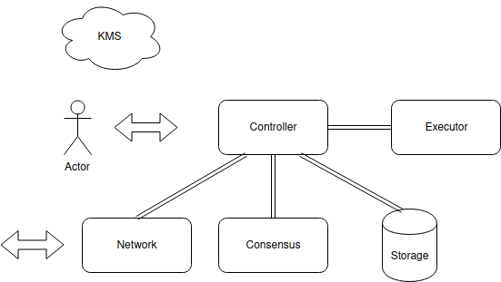
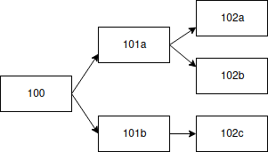
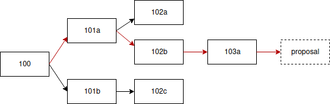
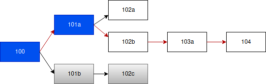

---

---

| Number | Category      | Status | Author | Organization | Created    |
| ------ | ------------- | ------ | ------ | ------------ | ---------- |
| 0002   | Informational | Draft  | 宁志伟 | 溪塔科技     | 2020-06-29 |

# CITA-Cloud底层链技术白皮书

## 背景

区块链技术诞生已经超过十年，但是相关的技术研究还在不断发展，新的技术依旧层出不穷。为了紧跟最新技术进展，同时也为了满足企业市场灵活多变的需求（详情参见 [产品定位白皮书](../0001-positioning/0001-positioning.md)），这就要求联盟链底层具备非常强的可定制性。

联盟链底层将不再是单一的产品，而是可以根据不同应用场景进行剪裁和定制，形成一系列的产品。

那么为什么这样细节不同的一系列链还可以看作是相互有关系的？什么才是一个区块链链最核心的东西？

我们可以把区块链分成以下三部分：

1. 核心数据结构。交易和块的数据结构。
2. 核心流程。出块/查询/节点间同步等流程。
3. 功能性组件。比如网络/共识算法/存储/虚拟机等。

一个区块链最核心的应该是其核心数据结构，核心流程和功能性的组件应该都是可裁剪可替换的。

## CITA-Cloud底层链是什么

`CITA-Cloud`底层链是一个精简的联盟链协议和微服务框架。

使用`ProtoBuf`定义了核心数据结构，使用`gRPC`定义了组件之间的接口。协议具体内容参见[仓库](https://github.com/cita-cloud/cita_cloud_proto)。

这样做的好处有：

1. 语言无关。开发者可以使用任何熟悉的编程语言来实现组件。同时也可以很方便的把已有的库封装成组件。
2. 功能性组件可替换。替换某一个组件无需其他组件配合修改。开发者可以只专注在自己精通的领域，其他的使用已有的组件。
3. 形成一个组件市场。未来每种组件都有多种不同的实现，可以根据具体场景的需求挑选合适的组件定制一条链。
4. 保留链之间互通的可能性。因为核心数据结构定义在协议中，定制出的链均保持一致，将来可以通过跨链技术进行互通。

## 架构设计

核心设计思路是对核心流程和功能性组件进行正交分解，所有的组件和流程之间都是解耦的。达成核心流程可定制，功能组件可替换的目标。

#### 微服务

将链划分为`Controller`，`Network`，`Consensus`，`Storage`，`Executor`，`KMS`六个微服务。



*Figure 1. CITA-Cloud MicroServices*

关于微服务划分，其中的要点是：核心数据结构和核心流程都集中在`Controller`微服务中。其他微服务跟核心数据结构和核心流程解耦，使得它们成为纯功能性组件，可以灵活替换。`Controller`微服务类似`service mesh`框架中的控制面，通过调用其他微服务实现核心流程，这也是其名字的由来。如果要定制核心流程，比如先共识再执行或者先执行再共识；裁剪掉`Executor`等，可以通过修改`Controller`微服务来实现，同样不需要其他微服务配合修改。

#### 关键技术

从前述内容可以看出，本次架构设计的关键点是解耦。接下来，我们会逐项列出当下比较常见的区块链设计中存在耦合，以及`CITA-Cloud`中对应的解决方案。

###### **密码学算法**

区块链所需的最基础的两种密码学算法是哈希算法和签名算法，相关的密码学操作是所有组件都需要的，耦合比较严重。

一般的区块链项目都是在一开始选定一种哈希和签名算法的组合，后续不能替换。

但是哈希和签名算法也在发展，出现了一些性能和安全性更可靠的算法。企业用户也需要根据场景选择不同的密码学算法，比如在金融和政务场景，国内会要求使用符合国家密码标准的密码学算法。

有些区块链项目通过条件编译支持多种密码学算法，但是这种方案还不够灵活。

---

`CITA-Cloud`底层链将密码学算法单独抽离出一个`KMS`微服务，形式上类似于一个软件加密机，但是功能上稍有不同。

其他微服务涉及到密码学相关的操作时，通过`rpc`接口调用`KMS`，从而实现了解耦，可以更加灵活的替换密码学算法。

这样做的问题是密码学操作非常的频繁，从原有的直接函数调用改为`rpc`调用可能会导致性能瓶颈。

解决方法是可以部署多个`KMS`微服务的实例来分担压力。

###### **网络**

六个微服务之中，只有`Network`可以跟其他节点通信，类似一个网关。

其他微服务如果需要网络功能，比如共识需要广播投票给其他节点，`Controller`需要跟其他节点同步数据，都要通过`Network`微服务转发。

反过来，`Network`从收到其他节点的消息，也需要拆包查看具体是什么消息，然后再调用相应微服务的接口去处理。

这里就导致`Network`跟这些需要网络功能的微服务之间存在耦合。比如，替换一个共识算法之后，可能需要的网络消息类型会增加或者减少，导致`Network`微服务也需要配合修改。

---

本解决方案采用控制反转。

让其他使用网络功能的微服务来注册其`rpc`服务的`EndPoint`和其关心的网络消息的特征。

```protobuf
message RegisterInfo {
    string module_name = 1;
    string hostname = 2;
    string port = 3;
}

rpc RegisterNetworkMsgHandler(RegisterInfo) returns (common.SimpleResponse);
```

同时定义了统一的网络消息处理`Service`接口，需要网络功能的微服务都要实现这个接口。

```protobuf
message NetworkMsg {
    string module = 1;
    string type = 2;
    uint64 origin = 3;
    bytes msg = 4;
}

service NetworkMsgHandlerService {
    rpc ProcessNetworkMsg(NetworkMsg) returns (common.SimpleResponse);
}
```

`Network`收到网络消息后，根据注册的信息对该消息进行动态分发。

这样在开发阶段，`Network`微服务无需关心哪些微服务需要网络功能，实现解耦。

###### **系统配置**

联盟链常用的共识算法`PBFT`不支持动态增加/减少共识节点。

为了支持这一功能通常的做法是，在链上内置一个合约来管理共识节点列表。

链上会设置一个特殊的账户，称为系统管理员账户。该账户可以通过发送合约调用交易修改共识节点列表。

管理合约执行该交易之后，得到修改后的共识节点列表，通知给共识微服务，下一次共识的时候变更生效。

像共识节点列表，系统管理员账户这一类会影响链本身行为的数据称为系统配置。

链上内置的，管理这些系统配置的合约称为系统配置管理合约。

不同的系统配置项会影响不同的微服务的行为。共识节点列表影响共识微服务，系统管理员账户会影响`Controller`微服务。

这会导致多个微服务都与`Executor`微服务形成耦合。

另外在存证这样的场景，可能会把`Executor`微服务直接裁剪掉。

因此必须采用一种不依赖`Executor`微服务的系统配置管理方案。

---

本解决方案采用的`UTXO`方式的系统配置管理方案。

即引入`UTXO`类型的交易结构：

```protobuf
message UtxoTransaction {
    uint32 version = 1;
    bytes pre_tx_hash = 2;
    bytes output = 3;
    uint64 lock_id = 4;
}
```

`pre_tx_hash`指向上一次修改系统配置的交易，`output`中直接存放本次修改之后的系统配置项的值，`lock_id`标识该交易关联的系统配置项。

因为交易中直接就存放了结果，因此微服务只要看到新出的块中打包了自己关心的系统配置项相关的`UTXO`交易，就可以直接从中解析出新的系统配置项的值，而无需依赖`Executor`微服务。

目前`UTXO`类型的交易仅仅用在系统配置管理方面，但是将来如果发现有场景更适合`UTXO`模式，也很容易将其推广到更多的场景。

###### **共识算法的确定性**

不同的共识算法会表现出不同的确定性：

- `PBFT`类的共识算法，共识完成后就确定了。
- `Chained HotStuff`，需要经过5个块之后，结果才确定。
- `PoX`类的共识算法，永远不能100%确定，只能逐渐逼近。

不同的确定性，会给共识后续的流程带来很大的变化。

就达不到预期的随意替换共识算法的效果。

---

本解决方案引入一个配置参数——`Block Delay Number`，其含义是一个块经过共识之后，要等后面累加多少个块，前面那个块才算确定。

这个参数的取值对于`PBFT`来说是0；对于`Chained HotStuff`来说就是5；对于`POX`来说，就要定一个经验值了，比如比特币通常是6。

共识之后的块不会马上进入后续的流程，而是根据该配置项的值，延迟对应的块数之后，才进入后续的处理流程。对于后续流程来说，不管采用什么共识算法，都跟采用`PBFT`类共识算法时的处理是一样的。

###### `proposal`**校验**

共识发出的`proposal`本质是一个块，只不过是还没有经过共识的候选块。

因此共识收到别的节点发过来的`proposal`，对其进行合法性检查的时候，不可避避免的会对核心数据结构，以及链当前的高度，块哈希等信息产生耦合。

---

本解决方案将`proposal`相关的处理划分到`Controller`微服务中。

`Controller`微服务中会维护一个包含链所有分叉的树，树的高度为`Block Delay Number`加一，加的这个一就是`proposal`。



*Figure 2. Fork Tree*

1. 共识在一次共识开始之前会先调用`Controller`微服务的`GetProposal`接口：

   - 如果当时树上已经有`proposal`了，就把这个`proposal`的哈希返回给共识。
   - 如果当时树上没有`proposal`。会从所有分叉中选择最长链为主链，然后从交易池取交易，构造一个`proposal`作为主链的最新块。同时将该`proposal`广播给其他节点(其他节点收到`proposal`之后，由`Controller`微服务处理，检查其合法性之后，加入本地维护分叉的树)。后续同样把这个`proposal`的哈希返回给共识。

   

   *Figure 3. Proposal 红色箭头标记了当前认定的主链*

   在这个设计里，共识不关心块的具体内容，只共识块哈希。因此，真正意义上的`proposal`——共识微服务发出的提案消息，里面只有对应的块的哈希。

2. 共识收到别的节点发出的提案之后，会调用`Controller`微服务的`CheckProposal`接口。前面已经提到过，对应的块的合法性`Controller`微服务已经处理过了，所以这里就直接返回一个`Bool`类型的结果。

3. 共识完成之后，会调用`Controller`微服务的`CommitBlock`接口，通知其某个候选块已经经过了共识。`Controller`微服务会检查树中已经确认的块中，是否有某个分叉高度已经超过`Block Delay Number`。

   - 如果没有，则继续等待。

   - 如果有，则表示之前的一个块已经得到确认。不包含这个块的其他分叉会从树上裁剪掉；如果有`Executor`微服务，会将该块送去执行，并得到一个执行之后的块的哈希；这个块以及对应的交易等信息会送到`Storage`微服务进行持久化存储。

   

   *Figure 4. Commit 假定104 commit之后101高度的块就确认为101a，灰色的分支被裁剪掉*

###### `Executor`**设计**

`Executor`微服务其实非常复杂，包含：智能合约语言的`vm`，历史状态的存储和管理，交易执行过程中的`log`，交易执行后的`receipt`，还有快照等更复杂的功能。完整的实现这些功能的话，`Executor`微服务的代码量几乎能占到整体代码的一半。

`Executor`也无法成为一个纯功能组件，它要解析块并执行其中的交易，必定跟核心数据结构耦合。之前的方案一般是在核心数据定义中就包含`log`，`receipt`等`Executor`特有的数据结构。如果是先共识再执行的流程的话，共识阶段的块其实是个不完整的块，`Executor`相关的字段都留空，等待执行之后再填充完整。这就导致核心数据结构跟`Executor`的具体实现耦合。

---

`CITA-Cloud`通过前述各种解耦方案，使得`Executor`已经相对比较独立了。而且在一些简单的场景，比如存证，`Executor`微服务不是必须的。

因此，`CITA-Cloud`在设计上`Executor`就是可选的。核心数据结构的定义不考虑`Executor`的影响，不包含其特有的数据结构，仅仅在`BlockHeader`中保留了一个`executed_block_hash`字段。

```protobuf
message BlockHeader {
    // hash of previous BlockHeader
    bytes prevhash = 1;
    uint64 timestamp = 2;
    uint64 height = 3;
    bytes transactions_root = 4;
    bytes proposer = 5;
    // 1. use aggregated signature, it's proof of current block
    // 2. otherwise, it's proof of previous block
    bytes proof = 6;
    // 1. executed before consensus, it's hash of current ExecutedBlock
    // 2. otherwise, it's hash of previous ExecutedBlock
    // Note: ExecutedBlock is defined by executor.
    bytes executed_block_hash = 7;
}
```

这样的设计也给`Executor`的实现保留了非常大的自由度：

1. 自定义数据结构。`log`，`receipt`等数据结构可以根据具体实现灵活调整。
2. 可以使用任意的智能合约语言。
3. 存储方式。状态数据不保存在`Storage`中，而是`Executor`自己存储。可以选择传统的`KV DB`，也可以为了支持复杂查询而选择`SQL DB`，甚至可以直接使用文件系统。
4. 历史状态管理方式。如果链上状态变化不是很频繁，可以不使用传统的`MPT`方式，而是简单粗暴的采用快照的方式。
5. 可以实现一些特色功能。比如采用类似`Git LSF`的方案支持大文件直接上链。

## 总结

为了满足新技术的更迭和企业市场多变的场景，我们提出了下一代联盟链架构——`CITA-Cloud`。重新进行了微服务的划分，更重要的是综合多项创新技术，将各个微服务彻底解耦。在增强了可定制性的同时，也变得更加开放。产品从单一的一个联盟链产品变成了一个可以根据场景定制一条链的框架。我们也会秉承开放的态度，通过跟各方的合作，打造一个更加强大和完善的产业联盟链生态。