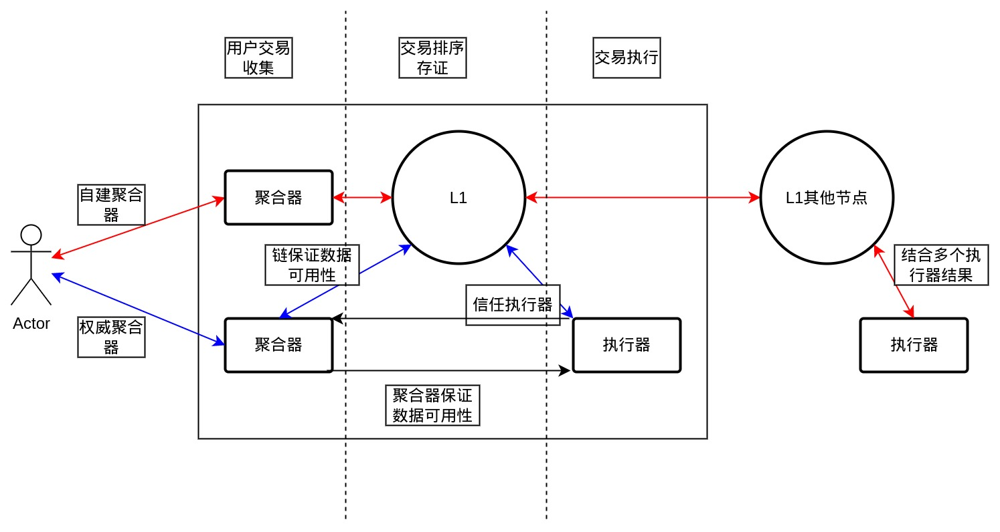
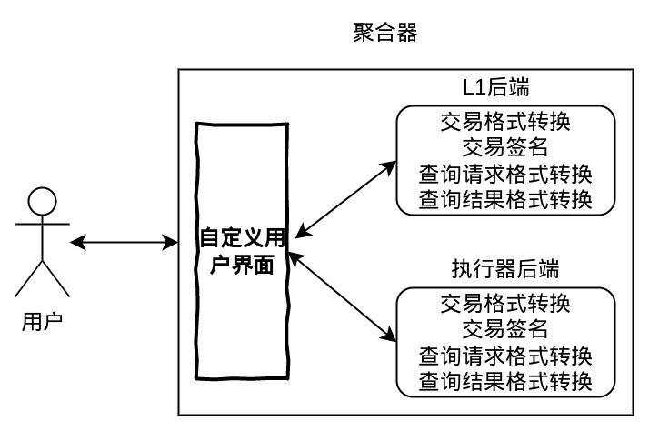

---

---

| Number | Category     | Status | Author | Organization | Created    |
| ------ | ------------ | ------ | ------ | ------------ | ---------- |
| 0006   | Protocol     | Draft  | 宁志伟  |  溪塔科技     | 2022-02-23 |

# 006-rollup

# 概述

`Rollup`的具体概念这里就不做赘述，网上相关的资料非常多。

对于公链来说，`Rollup`是一个扩容方案，从以下几方面提升区块链系统的性能：

1. 聚合器收集用户交易，然后批量打包发送到`Layer 1`上，可以节省`gas`。在同样的`gas limit`下，区块可以打包更多的交易。
    * 对交易进行压缩。去除非必要字段；直接数据压缩。
    * 以`calldata`的方式发送到链上，这种存储形式的`gas`消耗更低。
2. 链外计算，`Layer 1`的负担减轻了。
3. `Arbitrum`还提出了序列器方案，由中心化系统对交易进行排序，进一步提升系统性能。

对于联盟链来说，`Rollup`提升性能方面的作用并不重要：

1. 联盟链的性能本身就很高。
2. 联盟链一般没有`gas`的概念。

更看中的是`Rollup`提供了区块链进一步解耦的思路：

1. 用户直接与聚合器进行交互，而不是链。用户接口和相应的数据结构（交易结构）与链解耦。
2. 合约引擎与链解耦。
    * `Layer 1`链只提供存证功能，保证原始交易的数据有效性，和对计算结果的存证。
    * 合约部分将跟传统应用开发类似，开发者可以用更灵活的方式开发智能合约。
3. 序列器提供了去中心化与中心化结合的方式。用户可以根据信任程度走不同的路径，甚至在信任的前提下，数据有效性可以由单一中心化系统保证，更好的与传统系统结合。

# 动机

整个联盟链系统可以更加贴近应用场景：

1. 用户接口可以更贴近应用，设计为更适合应用的方式。比如：
    * 数据结构可以针对特定应用优化。
    * 验证方式不一定使用数字签名，可以用更传统的用户名/密码等方式。
2. 智能合约开发形式更接近传统应用。
    * 使用通用编程语言。
    * 智能合约是一个单独的系统，设计更加灵活。
3. 实现去中心化和中心化相结合的方式，更加贴近现实场景。
    * 用户信任中心化系统时，可以走中心化系统，作为`fast path`。
    * 用户不信任中心化系统的时候，走去中心化系统作为`slow path`。

# 设计方案



*整体架构图*

纵向支持三种方式：
1. 红色线路是传统的区块链方案。数据有效性和计算正确性都由链来保证。
2. 蓝色线路是类似公链领域`Rollup`方案。数据有效性由`Layer 1`链来保证，计算正确性由`Layer 2`系统保证（辅以一些链外机制和技术）。
3. 黑色路线是全聚合器即传统中心化方案。数据有效性和计算正确性都由中心化系统来保证。

横向分为三个阶段：
1. 用户交易收集。解决审查攻击问题。
2. 交易排序与存证。解决交易顺序和保存的问题。
3. 交易执行。解决计算结果正确性问题。

### 技术方案

1. 聚合器如何解决审查攻击问题？

    采用开源聚合器的方式来解决审查攻击问题。

    用户如果认为自己受到了审查攻击，可以自建聚合器。

2. 交易顺序如何决定？交易如何保存？
    
    * 对于红色和蓝色路线，交易通过`Layer 1`链来对交易进行排序，并保存在链的数据库中。

    * 对于黑色路线，聚合器直接对交易进行排序，保存在聚合器本地的数据库中。

3. 计算结果正确性如何保障？

    * 对于红色路线，跟现有区块链系统保持一致。执行器执行完一个区块内的交易后，需要对当前状态计算一个密码学证据，即以太坊中的`state root`。这个证据会经过共识流程，确保所有节点的计算结果一致。

    * 对于蓝色路线，`Layer 1`链的执行器退化为一个特殊的原生合约，提供对`Layer 2`的身份管理和计算结果管理功能。`Layer 2`执行完一个区块内的交易后，同样需要对当前状态计算一个密码学证据。然后以发交易的方式，将这个密码学证据提交到`Layer 1`链的特殊原生合约中。对于`Layer 1`来说跟红色路线一样，执行器依然要提供当前状态的密码学证据，并需要经过共识。这样可以保证`Layer 2`的计算结果是被`Layer 1`记录，并且是不可篡改的。辅助以链外的奖惩措施，或者启用多个`Layer 2`来确保其计算结果的正确性。

    * 对于黑色路线，计算结果的正确性完全由中心化系统来保证。

#### 聚合器

聚合器主要提供更简单易用的用户界面，本方案并不限制聚合器的具体方案，并且鼓励针对具体的应用设计更符合用户喜欢的用户界面。比如：

* 使用`JSON`格式来描述交易结构。
* 提供密钥托管功能，为最终用户提供用户名/密码校验方式。

##### 发送交易

对于红色和蓝色路线，后端仍然要对接`Layer 1`链，最终还是要把交易转换为`Layer 1`链的交易格式，并提供相应的交易签名。

对于黑色路线，聚合器可以不提供交易格式转换和签名功能，但是需要提供交易的持久化存储功能。

##### 状态查询

对于红色路线，状态需要到`Layer 1`链上查询。聚合器同样只需要对查询请求进行格式转换和转发，以及对返回结果的格式转换和转发。

对于蓝色和黑色路线，状态直接从执行器查询，同样要进行格式转换和转发。



*聚合器架构图*

#### Layer 2管理合约

分为两部分功能：

1. 对`Layer 2`信息的管理。针对同一条链`Layer 2`可以有多个，每个都有自己的账户。这部分信息只有管理员可以修改。
2. 对`Layer 2`执行结果的管理。同时记录不同`Layer 2`在不同高度的执行结果。只有注册过的`Layer 2`账户地址才可以提交执行结果。

数据结构

```rust
// L2账户信息
struct L2AccountInfo {
    // L2账户地址
    address: Address,
    // L2运行者
    operator: String,
    // L2详细信息
    description: String,
}

struct L2Result {
    // L2账户地址
    address: Address,
    state_root: H256,
}

struct L2Management {
    // l2账户列表
    l2_account_list: Vec<L2AccountInfo>,
    
    // block_height -> l2 result list
    state_result_map: HashMap<u64, Vec<L2Result>>,
}

```

接口

```rust
impl L2Management {
    // 增加l2帐号
    pub fn add_l2_account(addr: Address, operator: String, description: String) -> Bool;

    // 删除l2帐号
    fn delete_l2_account(addr: Address) -> Bool;

    // 查询l2帐号
    fn query_l2_account(addr: Address) -> Option<L2AccountInfo>;

    // 提交l2执行结果
    fn submit_l2_result(addr: Address, height: u64, state_root: H256);

    // 查询指定高度的执行结果
    fn query_l2_result(height: u64) -> Vec<L2Result>;
}
```

`Layer 2`运营者：
1. 需要向管理员提交自己的账户地址和相关信息，然后管理员注册到`Layer 1`链上。
2. 之后就可以用注册的帐号直接通过发交易的方式提交计算结果到`Layer 1`链上。

用户：
1. 可以查询指定高度下，多个`Layer 2`的执行结果。
2. 依据自己所需的信任程度，判断是否采信相应的执行结果。比如，对于信任的`Layer 2`运营者，可以直接采信其提交的执行结果；或者等待有足够多数量的`Layer 2`运营者提交了相同的计算结果。


# 替代方案

无

# 兼容性

不涉及

# 参考实现

无

